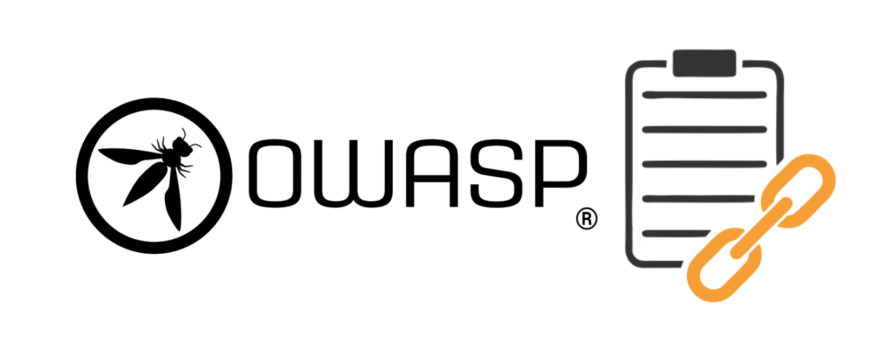
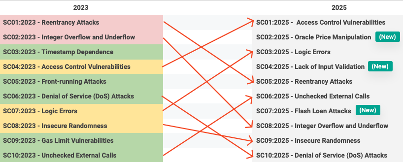

# [OWASP Smart Contract Top 10](https://owasp.org/www-project-smart-contract-top-10/)

## About the Smart Contract Top 10

The OWASP Smart Contract Top 10 (2025) is a standard awareness document providing Web3 developers and security teams with insights into the top 10 vulnerabilities found in smart contracts.

It serves as a reference to ensure that smart contracts are secured against the most critical weaknesses exploited or discovered in recent years.

## Changes

### Top 10

* SC01:2025 - [Access Control Vulnerabilities](2025/en/src/SC01-access-control.md)
* SC02:2025 - [Oracle Price Manipulation](2025/en/src/SC02-oracle-price-manipulation.md)
* SC03:2025 - [Logic Errors](2025/en/src/SC03-logic-errors.md)
* SC04:2025 - [Lack of Input Validation](2025/en/src/SC04-lack-of-input-validation.md)
* SC05:2025 - [Reentrancy Attacks](2025/en/src/SC05-reentrancy-attacks.md)
* SC06:2025 - [Unchecked External Calls](2025/en/src/SC06-unchecked-external-calls.md)
* SC07:2025 - [Flash Loan Attacks](2025/en/src/SC07-flash-loan-attacks.md)
* SC08:2025 - [Integer Overflow and Underflow](2025/en/src/SC08-integer-overflow-underflow.md)
* SC09:2025 - [Insecure Randomness](2025/en/src/SC09-insecure-randomness.md)
* SC10:2025 - [Denial of Service (DoS) Attacks](2025/en/src/SC10-denial-of-service.md)

### Overview

| Title | Description |
| -- | -- |
| SC01 - Access Control Vulnerabilities | Access control flaws allow unauthorized users to access or modify a contract's data or functions. These vulnerabilities arise when the code fails to enforce proper permission checks, potentially leading to severe security breaches. |
| SC02 - Oracle Price Manipulation | Oracle price manipulation exploits vulnerabilities in how smart contracts fetch external data. By tampering with or controlling oracle feeds, attackers can affect contract logic, leading to financial losses or system instability. |
| SC03 - Logic Errors | Logic errors, or business logic vulnerabilities, occur when a contract's behavior deviates from its intended functionality. Examples include incorrect reward distribution, token minting issues, or flawed lending/borrowing logic. |
| SC04 - Lack of Input Validation | Insufficient input validation can lead to vulnerabilities where an attacker may manipulate the contract by providing harmful or unexpected inputs, potentially breaking logic or causing unexpected behaviors. |
| SC05 - Reentrancy Attacks | Reentrancy attacks exploit the ability to reenter a vulnerable function before its execution is complete. This can lead to repeated state changes, often resulting in drained contract funds or broken logic. |
| SC06 - Unchecked External Calls | Failing to verify the success of external function calls can result in unintended consequences. When a called contract fails, the calling contract may incorrectly proceed, risking integrity and functionality. |
| SC07 - Flash Loan Attacks | Flash loans, while useful, can be exploited to manipulate protocols by executing multiple actions in a single transaction. These attacks often result in drained liquidity, altered prices, or exploited business logic. |
| SC08 - Integer Overflow and Underflow | Arithmetic errors due to exceeding the limits of fixed-size integers can lead to serious vulnerabilities, such as incorrect calculations or token theft. Unsigned integers wrap around on underflow, while signed integers flip between extremes. |
| SC09 - Insecure Randomness | Due to the deterministic nature of blockchain networks, generating secure randomness is challenging. Predictable or manipulable randomness can lead to exploitation in lotteries, token distributions, or other randomness-dependent functionalities. |
| SC10 - Denial of Service (DoS) Attacks | DoS attacks exploit vulnerabilities to exhaust contract resources, rendering it non-functional. Examples include excessive gas consumption in loops or function calls designed to disrupt normal contract operation. |

## Licensing
The OWASP Smart Contract Top 10 (2025) is licensed under the [CC BY-NC-SA 4.0](https://creativecommons.org/licenses/by-nc-sa/4.0/), the Creative Commons Attribution-ShareAlike 4.0 license. Some rights reserved.

## Project Leaders
- [Jinson Varghese Behanan](mailto:jinson@owasp.org) (Twitter: [@JinsonCyberSec](https://twitter.com/JinsonCyberSec))
- [Shashank](mailto:shashank@credshields.com) (Twitter: [@cyberboyIndia](https://x.com/cyberboyIndia))
